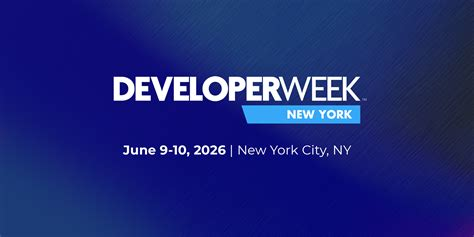
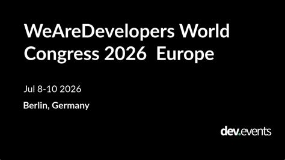
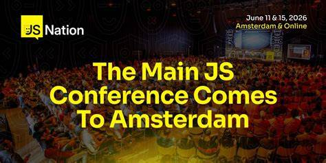

# Developer conferences - June-July 2026

## Developer week - New York
 

 
**Conference website**
[Developer Week](https://www.developerweek.com/newyork/)

**Conference presentation**

Developer Week, the east coast's largest independent developer and software conference/expo brings 1200+ developers, engineers, software architect, teams and managers from 72+ countries to New York for 2 days with a wide choice of events, workshops and seminars

**Conference dates**

9 June - 10 June

**Conference key speakers**

- Alex Lisle - CTO of Reality Defender
- Bala Muthiah - Engineering Director of Lyft
- David Campbell - AI Risk and Security Lead of Scale AI

And many more...

**Event breakdown**

9 June
- Expo 9:00 AM - 7:00 PM
- Hackaton 9:00 AM - 7:00 PM
- Sessions 9:30 AM - 5:00 PM
- Keynotes 9:30 AM - 5:00 PM
- Expo Block Party 4:30 PM - 7:00 PM
- VIP Welcome Party 7:30 PM - 9:00 PM

10 June
- Expo 9:00 AM - 4:00 AM
- Hackaton 9:00 AM - 10:00 AM
- Sessions 9:30 AM - 3:30 PM
- Keynotes 9:30 AM - 4:00 PM
- Top 5 Hackaton Teams Demo 3:00 PM - 3:25 PM
- Hackaton Winners 3:30 PM - 3:45 PM 

 
 
 

## WeAreDevelopers
 

 
**Conference website**
[WeAreDevelopers](https://www.wearedevelopers.com/world-congress/)

**Conference presentation**

WeAreDevelopers is a global developer event to discover tools, ideas and celebrate building software. Thousands and more of developers and tech professionals every year join to celebrate, learn from each other and push technology forward.

**Conference dates**

8 July - 10 July

**Conference key speakers**

Notable CEOs and CTOs from Amazon, Nvidia, Vercel, Netlify bringing and translating their industry insight to understandable format to let you understand what you couldn't from the industry

and many more ...

**Event breakdown**

With 15000+ builders, 8000+ companies and 20+ stages choose from a wide choice of events:
- Inspiration talks
- Tech talks
- Live coding
- Workshops
- Tech expositions
- Live challenges
- Community events and building
- Live music and stages

 
 
 

## JSNation - Amsterdam
 

 
**Conference website**
[JSNation](https://jsnation.com/schedule-offline)

**Conference presentation**

JSNation is a 2-day 2-track event focusing on full-stack engineering. Discover the future of the Web development ecosystem and connect with developers interested in shaping the web both for the user and the tech that powers their lifestyle.

**Conference dates**

11 June and 15 June

**Some of the event line up and key speakers**

(As found on the website landing page, the event is gigantic and hosts themes about advanced javascript, frontend frameworks and even engineering of the web)

- FullStack Monitoring with Open Telemetry: End-to-End Observability for Modern Applications - Erick Wendel
- Designing a Migration to Micro-Frontends - Luca Mezzalira
- Building a JavaScript Engine in Rust: Lessons From Boa Jason Williams
- Life of an ESM in Node.js – and How It's Changing for the Better -Joyee Cheung
- Autonomous AI Agents in Action With the Ralph Wiggum Method - Eddy Vinck
- Orchestrating Content Workflows at Netflix Scale - Pratyusha Singaraju
- The Latest From Deno - Leo Kettmeir
- Click. Ship. Done. AI Agents on Cloudflare - Jan Peer Stöcklmair
- HTML in Canvas: Bridging UI and GPU on the Web - Santiago Colombatto

 
 
 

## AWS Summit Madrid
 

 
**Conference website**
[AWS Madrid](https://aws.amazon.com/es/events/summits/madrid/)

**Conference presentation**

AWS Summit Madrid is your gateway to the future of cloud and AI innovation. This complimentary, one-day event brings together the technologies of tomorrow.

**Conference dates**

4 June

**Conference key speakers**

- Tanuja Randery - VP and Director of AWS Emea
- Nandini Ramani - VP of AWS
- Suzana Curic - Country leader of Iberia AWS
- Raúl Costilla Prieto - Director of Mapfire

**Event highlights**

- 200+ presentations across agentic AI, data, security and cloud innovation
- Explore how AWS in shaping industries with demos and expert panels tackling key sector challenges
- Connect with AWS experts and startup sector colleagues and access resources to fast-track your startup's growth
- Explore how to move to the cloud with dedicated AWS experts presenting the full suite of solutions

 
 
 

## Google Cloud Summit - London
 

 
**Conference website**
[Google Cloud Summit](https://www.googlecloudevents.com/london-summit)

**Conference presentation**

Join Google Cloud Summit London to connect with experts, discover enterprise-ready agentic AI solutions, and experience how we’re building the way forward in a new era of AI.

**Conference dates**

17 June - 18 June

**Conference key speakers**

Presidents, Vice presidents, Directors and managing directors of Google Cloud business units encompassing the entirety of the cloud giant that we consider as the internet from cloud service engineering to security and of course AI.

And many more ...

**Event breakdown**

17 June
- 9:10 AM - 10:30 AM Google Cloud Keynote
- 10:45 AM - 12:00 AM Cloud talks
- 01:00 PM - 04:45 PM Cloud talks

18 June
- 09:10 AM - 10:30 AM Google Cloud Developer Keynote
- 10:45 AM - 12:00 PM Cloud talks
- 10:45 AM - 12:00 PM Cloud talks

Each session has breaks and the day comes with a lunch, dinner and relaxed workshop breaks

